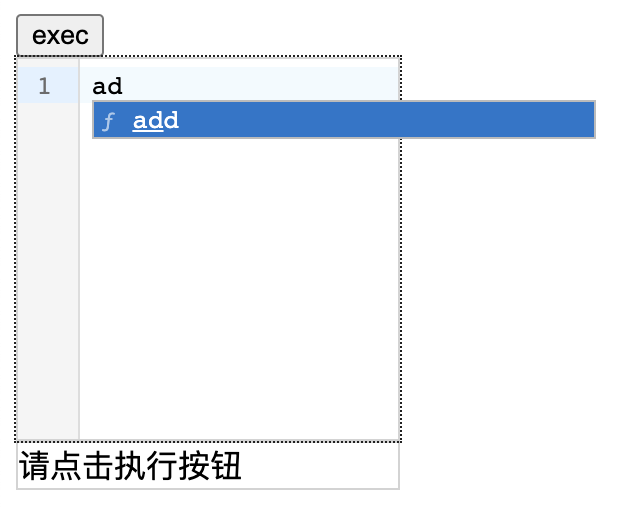
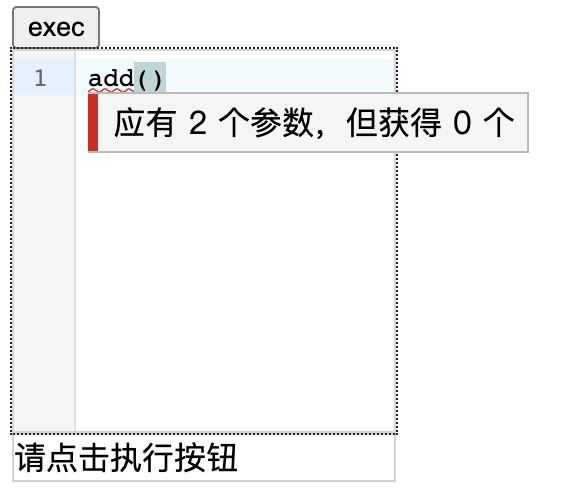
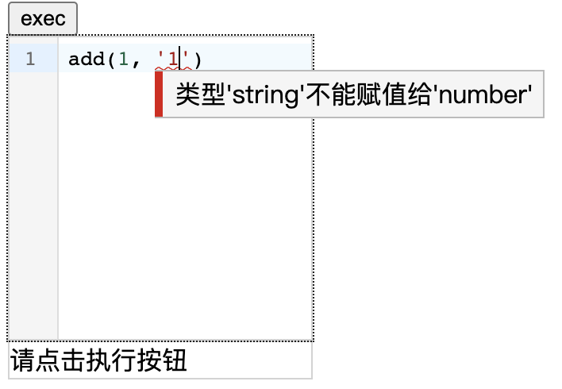
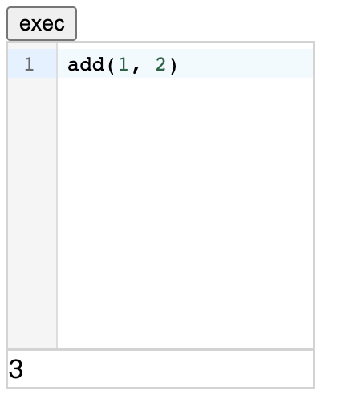
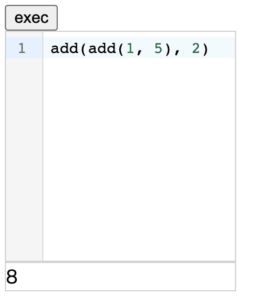
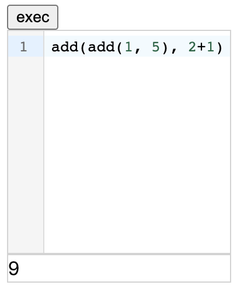

# 介绍

使用 vue3 集成 [codemirror](https://codemirror.net)，这里直接用了 [vue-codemirror](https://github.com/surmon-china/vue-codemirror)，简单实现了基于 *codemirror* 的 *linter* 检查参数类型并执行代码。


# 使用

代码中提供了如何实现一个 `add(a, b)` 的例子，点击 `exec` 按钮执行代码。

## 界面截图

- 输入联想

	

- 参数数量提示

  

- 参数类型提示

  

- 执行结果

  

- 函数嵌套

  

- ‘+’

  


# 代码

## 简单写法

```typescript
const codeConfig = getCodemirrorConfig(code, {
    functions: [
        {
            label: 'add',
            template: 'add(${arg0}, ${arg1})',
            func: (a: number, b: number) => a + b,
            returnType: [CODEMIRROR_TYPE.number],
            paramTypes: [[CODEMIRROR_TYPE.number], [CODEMIRROR_TYPE.number]]
        }
    ]
})
```

- `label` 和 `template` 都是 *codemirror* 的配置
- `func` 为最终执行的函数
- 类型考虑到 *或类型* 所以都用数组


## 装饰器写法

用装饰器封装了代码，用到了 `reflect-metadata`。

参考 `./src/reflect/Config.ts` 中的写法：

```typescript
class Config {
    @cmFunction('number')
    add(@cmParam('number') a: number, @cmParam('number') b: number) {
        return a + b
    }
}

const codeConfig = getCodemirrorConfig(code, {
    functions: getCodemirrorMetadata(new Config())
})
```

